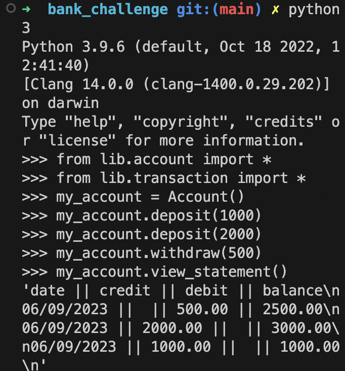

## bank_challenge

This app allows a user to create a bank account. The account keeps a list of transactions and the balance.

A user can then either deposit or withdraw amounts into their account.

A user can also view their statement which will show all transactions in reverse chronological order with the transaction date and closing balance after each transaction.

## Technologies and Design Principles

This app was built using Python 3. Python was chosen due to it's simplicity and it was appropriate for this app given it's required functionality.

SOLID principles were kept in mind and TDD was used throughout. Testing framework used was Pytest.

## Code Structure

There are two classes: Account and Transaction.

The Transaction class contains four properties: date, credit, debit and closing balance.

The Account class contains a "transactions" property as an initally empty array, and a balance property initially set to 0.

The account class contains deposit and withdraw functions. When these are called, a Transaction object is created with the deposit/withdrawal amount populated, the date of the transaction populated using the datetime module, and the balance property of the account object is updated by adding or removing the deposit/withdrawal amount to the balance. The Transaction object is also inserted after index 0 of the transactions array in the account object.

The account class also contains a view_statement function which displays the transactions list containing a list of transaction objects, each with date, credit amount, debit amount and closing balance.

## Design approach

I decided to have "Account" as a class as it contains information for multiple states i.e. all transactions and balance.

Transactions were declared as a separate class because a transaction contained multiple bits of information. Initially I thought about having transactions as just strings that would be fed into the account class and that would have sufficiently met the program requirements. However, given that a transaction contained multiple pieces of information I decided it would be better as a class and each transaction would be an object and I used to repr function to display each transaction as required by the program. Having each transaction as an object allows for easier extension in the future should additional functionality need to be added. This meant that the Transaction class would need to be sufficiently mocked in the unit tests for the Account class.

I also considered having the deposit and withdraw methods in the Transaction class instead of the Account class, but decided against this as following each transaction the account balance would need to be updated and this would require an instance of the Account class to be linked to the transaction. It made more sense for an account object to have many transactions rather than the other way around.

Possible future extensions could include adding "id" and "transaction_type" properties to the transaction class to enable further functionality with transactions such as undo a transaction or return only deposits or withdrawals.

## Running the app

### To run locally:

Clone repository to local:

`git clone https://github.com/usamaamir92/bank_challenge.git`

Change into bank_challenge directory:

`cd bank_challenge`

Start Python:

`python3`

Import modules:

`from lib.account import *`

`from lib.transaction import *`

To create an account, provide an account name. E.g.:

`my_account = Account()`

To deposit:

`my_account.deposit(deposit_amount)`

To withdraw:

`my_account.withdraw(withdrawal_amount)`

To view statement:

`my_account.view_statement()`

### To run tests:

After cloning repository and changing into bank_challenge directory:

Install pipenv if not already installed:

`pip install pipenv`

Install project dependencies and create virtual environment:

`pipenv install`

Activate virtual environment:

`pipenv shell`

Run pytest:

`pytest`

## Screenshot

<!--  -->